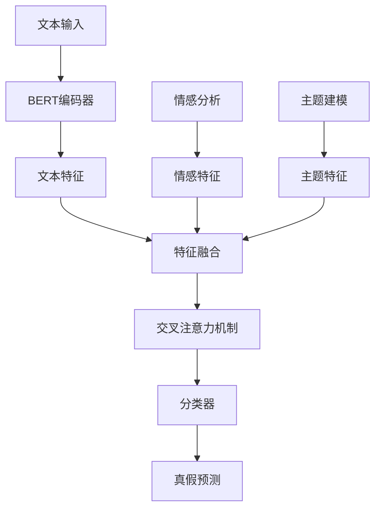

# 多模态（情感、主题语义）综合预测与分析

这是一个先进的多模态新闻真假分类系统，结合了文本语义、情感分析和主题建模特征，通过交叉注意力机制进行多模态融合，实现高精度的新闻真实性判断。

## 功能亮点

- **多模态特征融合**：整合文本、情感和主题特征
- **交叉注意力机制**：智能融合不同模态的特征
- **BERT文本理解**：深度理解新闻文本语义
- **主题建模分析**：识别新闻核心主题
- **情感特征提取**：分析文本情感倾向
- **全面评估指标**：提供多种性能评估可视化

## 安装指南

### 前置要求

- Python 3.7+
- CUDA 11.8+ (推荐GPU加速)
- PyTorch 2.0+
- NVIDIA GPU (推荐)

### 安装步骤

1. 克隆仓库：
```bash
git clone https://github.com/YukunDai/2022290220-DaiYukun.git
cd 多模态（情感、主题语义）综合预测与分析
```

2. 创建并激活虚拟环境：
```bash
python -m venv venv
# Windows:
venv\Scripts\activate
# Linux/macOS:
source venv/bin/activate
```

3. 安装依赖：
```bash
pip install -r requirements.txt
```

## 使用指南

### 数据准备

1. 下载 [Fake and Real News Dataset](https://www.kaggle.com/datasets/clmentbisaillon/fake-and-real-news-dataset)
2. 将CSV文件重命名为 `fake_and_real_news.csv` 并放在项目根目录

### 训练模型

```bash
python main.py
```

### 配置选项

在 `main.py` 中可修改以下参数：
```python
# 主要配置参数
DATA_PATH = "fake_and_real_news.csv"  # 数据集路径
BERT_MODEL = "bert-base-uncased"      # 使用的BERT模型
N_TOPICS = 10                         # 主题数量
BATCH_SIZE = 16                       # 批处理大小
EPOCHS = 5                            # 训练轮数
USE_ATTENTION = True                  # 是否使用交叉注意力机制
```

### 命令行参数

```bash
python main.py \
  --data_path "path/to/dataset.csv" \
  --bert_model "bert-large-uncased" \
  --n_topics 15 \
  --batch_size 32 \
  --epochs 10 \
  --use_attention
```

## 模型架构

### 多模态融合框架



### 关键技术

1. **文本特征提取**：使用BERT模型获取深度语义表示
2. **情感特征提取**：基于BERT的情感分析管道
3. **主题特征提取**：LDA主题建模
4. **交叉注意力机制**：动态融合多模态特征
5. **分类器**：多层感知机进行真假分类

## 输出示例

### 训练过程
```
Extracting Sentiment Features: 100%|██████████| 9900/9900 [05:46<00:00, 28.57text/s]
Training: 100%|██████████| 990/990 [04:38<00:00,  3.55batch/s]
Evaluating: 100%|██████████| 248/248 [00:23<00:00, 10.77batch/s]
Training: 100%|██████████| 990/990 [04:39<00:00,  3.55batch/s]
Evaluating: 100%|██████████| 248/248 [00:23<00:00, 10.40batch/s]
Training: 100%|██████████| 990/990 [04:40<00:00,  3.53batch/s]
Evaluating: 100%|██████████| 248/248 [00:22<00:00, 10.97batch/s]
Evaluating: 100%|██████████| 248/248 [00:22<00:00, 10.86batch/s]
```

### 评估指标
```
Validation Accuracy: 0.9990
ROC AUC: 1.0000
Precision-Recall AUC: 1.0000
```

## 性能优化

### GPU加速
```python
DEVICE = torch.device(
    "mps" if torch.backends.mps.is_available() else 
    "cuda" if torch.cuda.is_available() else "cpu")
```

### 批处理优化
```python
# 增加批处理大小
BATCH_SIZE = 32  # 根据GPU内存调整

# 使用混合精度训练
from torch.cuda.amp import GradScaler, autocast

scaler = GradScaler()
with autocast():
    # 前向传播...
```

## 自定义与扩展

### 添加新特征
```python
class MultimodalClassifier(nn.Module):
    def __init__(self, ...):
        # 添加新特征投影层
        self.new_feature_projection = nn.Linear(new_feature_dim, bert_dim)
        
    def forward(self, ... new_feature):
        # 融合新特征
        new_feature_proj = self.new_feature_projection(new_feature)
        features.append(new_feature_proj)
```

### 使用不同预训练模型
```python
# 使用RoBERTa代替BERT
from transformers import RobertaTokenizer, RobertaModel

tokenizer = RobertaTokenizer.from_pretrained("roberta-base")
self.bert = RobertaModel.from_pretrained("roberta-base")
```

